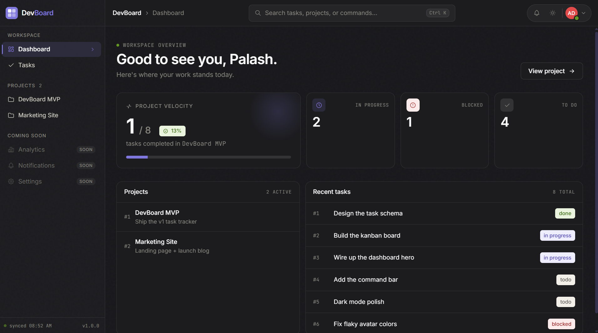
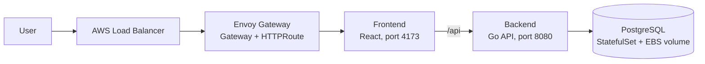
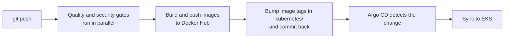
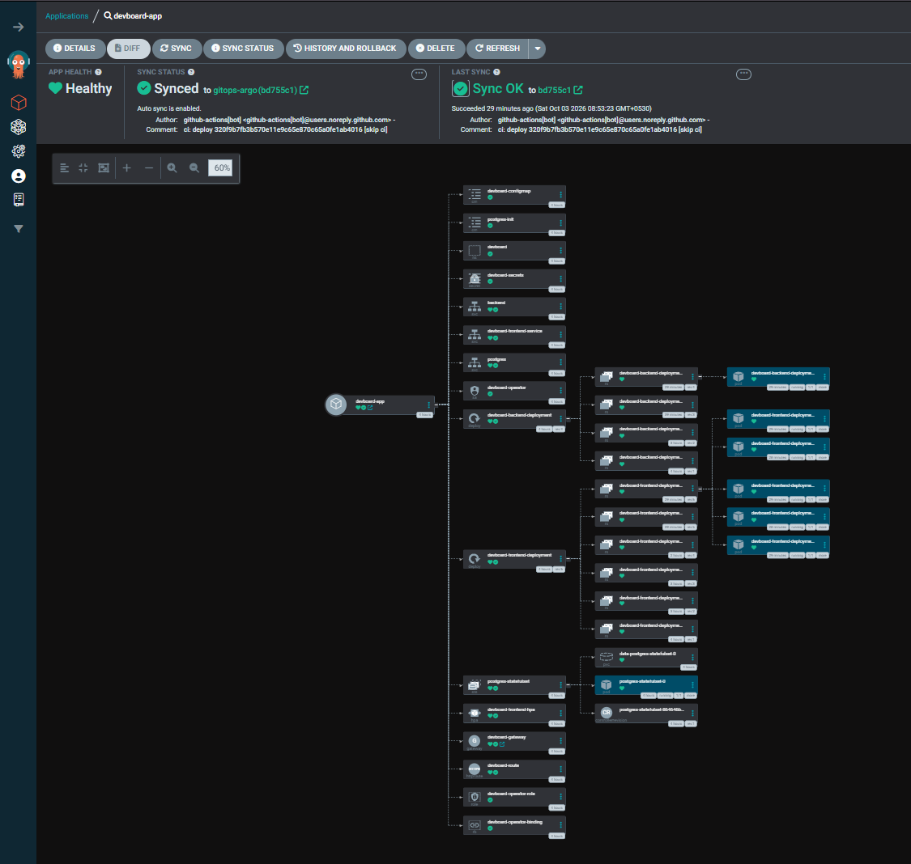
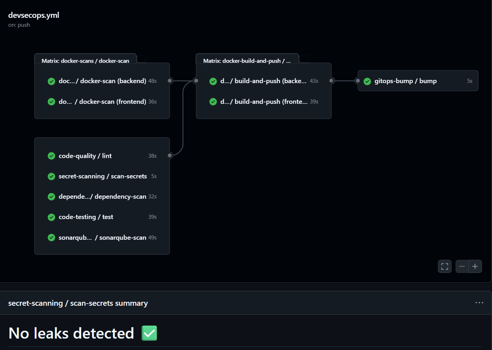
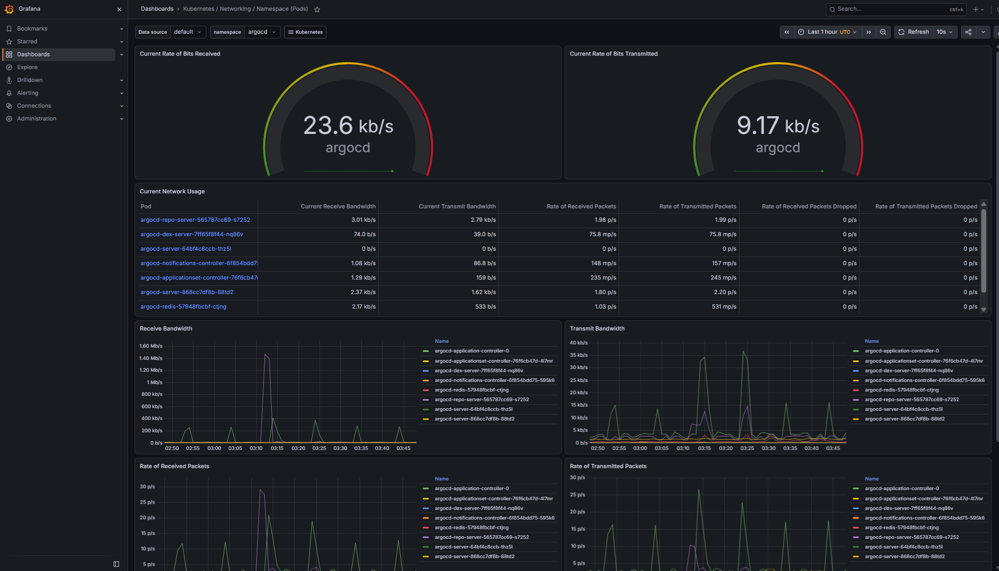

# DevBoard — 3-Tier App on AWS EKS with GitOps and DevSecOps

[](https://github.com/palash-dangat/devboard-project/actions/workflows/devsecops.yml)

DevBoard is a task-tracking app (React + Go + PostgreSQL) that I containerized, secured with a DevSecOps CI pipeline, and deployed to **AWS EKS using GitOps with Argo CD**. Every push is scanned, built, pushed to Docker Hub with a commit-SHA tag, and rolled out to the cluster automatically. CI never touches the cluster directly.



---

## Architecture

**Runtime (inside EKS)**



**Delivery (CI/CD + GitOps)**



---

## Screenshots

**Argo CD: app Healthy and Synced on EKS**



**DevSecOps pipeline (GitHub Actions)**



**Grafana: Kubernetes networking dashboard for the `argocd` namespace**



---

## Tech stack

| Area | Tools |
| --- | --- |
| Application | React (Vite), Go API, PostgreSQL 16 |
| Containers | Docker (multi-stage builds), Docker Compose |
| Orchestration | Kubernetes on AWS EKS (`eksctl`) |
| Ingress | Gateway API with Envoy Gateway |
| GitOps / CD | Argo CD (automated sync, prune, self-heal) |
| CI | GitHub Actions (reusable workflows) |
| Security | Gitleaks, Hadolint, Trivy, govulncheck, npm audit, SonarQube |
| Registry | Docker Hub |
| Monitoring | Prometheus and Grafana (kube-prometheus-stack, installed with Helm) |

---

## CI/CD pipeline

The pipeline is defined in [`.github/workflows/devsecops.yml`](.github/workflows/devsecops.yml) and calls one reusable workflow per stage. It runs on every push to `gitops-argo`, except pushes that only change `kubernetes/`.

| Stage | Workflow | What it does |
| --- | --- | --- |
| Code quality | `code-quality.yml` | ESLint (frontend), `gofmt` and `go vet` (backend) |
| Secret scanning | `secrets-scan.yml` | Gitleaks over the full git history |
| Dependency scan | `dependency-scan.yml` | `govulncheck` and `npm audit`; reports uploaded as an artifact |
| Tests | `code-testing.yml` | Frontend unit tests and `go test` |
| Docker scans | `docker-scans.yml` | Hadolint on each Dockerfile, then Trivy on the built image (CRITICAL severity) |
| SAST | `sonarqube-scan.yml` | SonarQube Cloud static analysis |
| Build and push | `docker.yml` | Builds both images, pushes `:latest` and `:<commit-sha>` to Docker Hub |
| GitOps bump | `image-bump.yml` | Writes the new SHA tag into the Deployments and commits it back |

The six gates run in parallel. Images are only built and pushed once all of them pass.

> Dependency scans and Trivy currently **report** findings without failing the build. See [Future improvements](#future-improvements).

### How GitOps works here

1. The bump job rewrites the image tag in `kubernetes/backend-deployment.yml` and `kubernetes/frontend-deployment.yml` and commits it as `ci: deploy <sha> [skip ci]`.
2. Argo CD watches the `kubernetes/` folder on the `gitops-argo` branch. It sees the new commit and syncs it to the cluster.
3. Images are tagged with the commit SHA instead of relying on `latest`, so every deployment is traceable to an exact commit and can be rolled back from Git history or the Argo CD UI.
4. The bump commit uses `[skip ci]` and the workflow ignores changes under `kubernetes/`, so the pipeline never triggers itself in a loop.

---

## Kubernetes setup

All manifests are in [`kubernetes/`](kubernetes), deployed to the `devboard` namespace.

| Resource | Purpose |
| --- | --- |
| `frontend-deployment`, `frontend-service` | React app (container port 4173, service port 8080), with liveness and readiness probes |
| `backend-deployment`, `backend-service` | Go API on port 8080, probes on `/health`. The service is named `backend` because the frontend proxies `/api` to that name |
| `postgres-statefulset`, `postgres-service` | PostgreSQL with a 1Gi EBS-backed volume (gp2) and a headless service |
| `postgres-init` | ConfigMap that loads the schema and seed data on first start |
| `config-map`, `secrets` | Database settings injected as environment variables |
| `frontend-hpa` | Horizontal Pod Autoscaler for the frontend (1 to 5 replicas on CPU) | HPA threshold (10%) is set low for demo |
| `gateway`, `httproute` | Gateway API resources that expose the app through an AWS load balancer |
| `sa-operator`, `role-operator`, `rolebinding-operator` | Namespace-scoped RBAC for an operator service account |

Resource requests and limits are set on the frontend and backend.

The EKS cluster is defined in [`eks-config/eks-cluster.yml`](eks-config/eks-cluster.yml): region `ap-south-1`, a managed node group of 2 to 3 nodes, OIDC enabled, and the `vpc-cni`, `coredns`, `kube-proxy`, `aws-ebs-csi-driver` and `metrics-server` add-ons.

---

## Repository structure

```
.
├── backend/                Go API (Dockerfile, tests)
├── frontend/               React app (Dockerfile, tests)
├── init/postgres/          Schema and seed data
├── kubernetes/             Manifests that Argo CD syncs
├── argoCD/                 Argo CD install values and Application manifest
├── eks-config/             eksctl cluster definition
├── gatewayclass.yml        Envoy GatewayClass
├── .github/workflows/      DevSecOps pipeline (reusable workflows)
├── docker-compose.yml      Run the full stack locally
├── Makefile                Shortcuts (make up, make down, make smoke)
├── sonar-project.properties
└── .env.example            Template for local settings
```

---

## Run it locally with Docker Compose

**Prerequisite:** Docker with Docker Compose.

```bash
git clone https://github.com/palash-dangat/devboard-project.git
cd devboard-project
cp .env.example .env
docker compose up -d
```

Open **http://localhost:8080**.

Compose pulls the prebuilt images from Docker Hub. To build them yourself instead:

```bash
docker build -t palashhh18/devboard-backend:latest ./backend
docker build -t palashhh18/devboard-frontend:latest ./frontend
```

| Service | URL | Notes |
| --- | --- | --- |
| Frontend | http://localhost:8080 | Forwards `/api` to the backend |
| Backend | http://localhost:8081/health | Go API health check |
| PostgreSQL | localhost:5432 | Demo credentials from `.env.example` |

Useful commands:

```bash
make smoke            # quick check that frontend, backend and database respond
make logs             # follow logs
docker compose down   # stop
docker compose down -v   # stop and wipe the database
```

---

## Deploy to AWS EKS

Tested on KIND first
**Prerequisites:** an AWS account with credentials configured, plus `aws`, `eksctl`, `kubectl` and `helm` installed.

**1. Create the cluster**

```bash
eksctl create cluster -f eks-config/eks-cluster.yml
kubectl get nodes
```

**2. Install the Gateway API controller (Envoy Gateway)**

```bash
helm install eg oci://docker.io/envoyproxy/gateway-helm \
  -n envoy-gateway-system --create-namespace
kubectl apply -f gatewayclass.yml
```

**3. Install Argo CD**

```bash
helm repo add argo https://argoproj.github.io/argo-helm
helm install argocd argo/argo-cd -n argocd --create-namespace \
  -f argoCD/argoCD-install.yml
```

**4. Create the Argo CD application**

```bash
kubectl apply -f argoCD/application.yml
```

Argo CD now syncs everything in `kubernetes/` into the `devboard` namespace automatically.

**5. Open the app**

```bash
kubectl get gateway -n devboard     # the ADDRESS column is the load balancer URL
```

**Argo CD UI (optional)**

```bash
kubectl port-forward svc/argocd-server -n argocd 8080:80
kubectl -n argocd get secret argocd-initial-admin-secret \
  -o jsonpath="{.data.password}" | base64 -d
```

Then open http://localhost:8080 and log in as `admin`.

### GitHub settings the pipeline needs

Under **Settings > Secrets and variables > Actions**:

| Type | Name | Purpose |
| --- | --- | --- |
| Variable | `DOCKERHUB_USERNAME` | Docker Hub account that images are pushed to |
| Secret | `DOCKERHUB_TOKEN` | Docker Hub access token |
| Secret | `SONAR_TOKEN` | SonarQube user token |
| Secret | `SONAR_HOST_URL` | URL of the SonarQube server |

---

## Monitoring

Prometheus & Grafana dashboards show pod and network health across the cluster, including the Argo CD components (see the screenshot above).

---

## Cleanup

EKS and load balancers cost money, so tear everything down when you are done. Delete the app first so the load balancer is removed before the cluster:

```bash
kubectl delete -f argoCD/application.yml
eksctl delete cluster -f eks-config/eks-cluster.yml
```

---

## Future improvements

- **Secrets management:** the Kubernetes `Secret` here holds demo credentials in base64, which is not encryption. For real use, move to Sealed Secrets or External Secrets with AWS Secrets Manager.
- **Enforce security gates:** make Trivy and the dependency scans fail the build on CRITICAL findings.
- **HTTPS:** add a TLS listener to the Gateway with a certificate.
- **Alerting:** Configure Alertmanager receivers (Slack/email) on top of the default rules.
- **Smaller attack surface:** replace `vite preview` in the frontend image with a static server such as nginx.

---

## Acknowledgements

  Built while learning from [TrainWithShubham](https://trainwithshubham.com)'s DevOps content.

## Author

**Palash Dangat** · DevOps & Cloud Engineer (fresher)
[LinkedIn]([https://www.linkedin.com/in/YOUR-PROFILE](https://www.linkedin.com/in/palash-dangat-46b79b298)) · [GitHub](https://github.com/palash-dangat)
